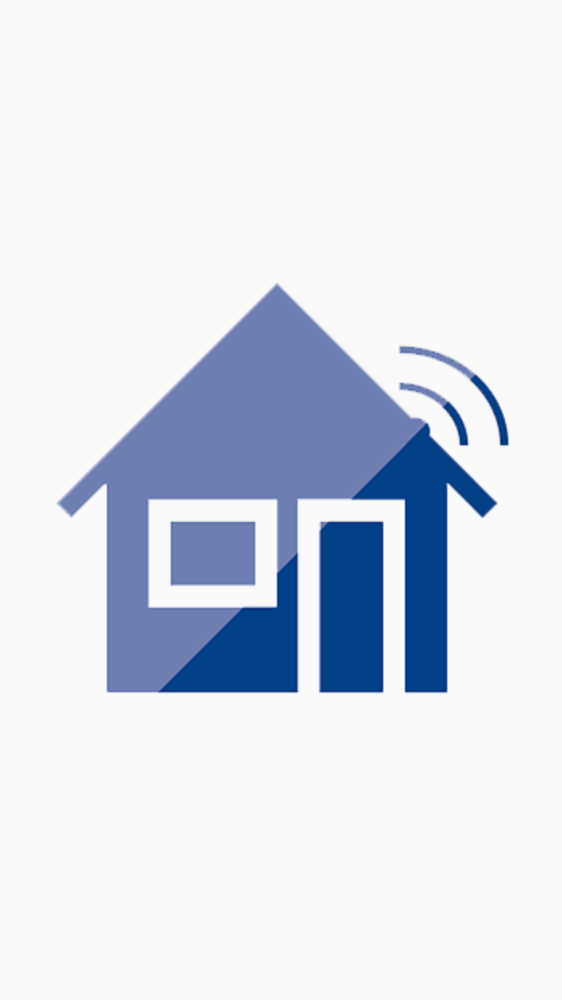
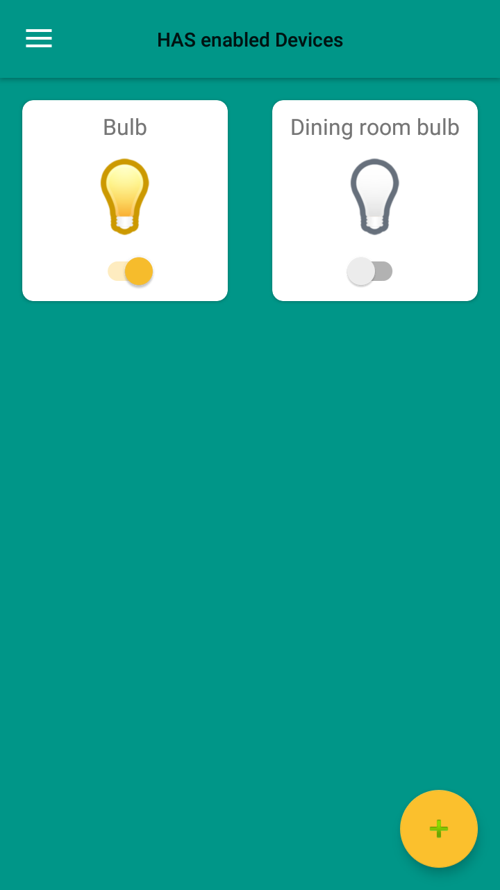
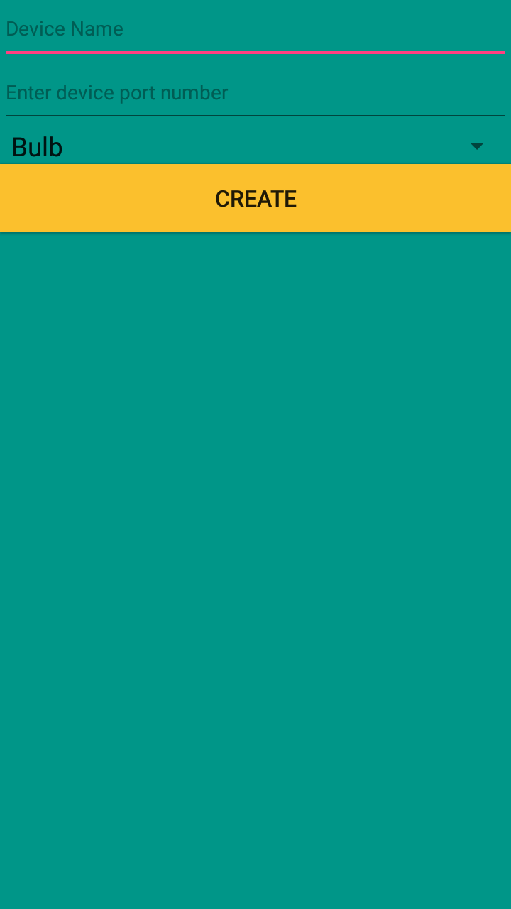
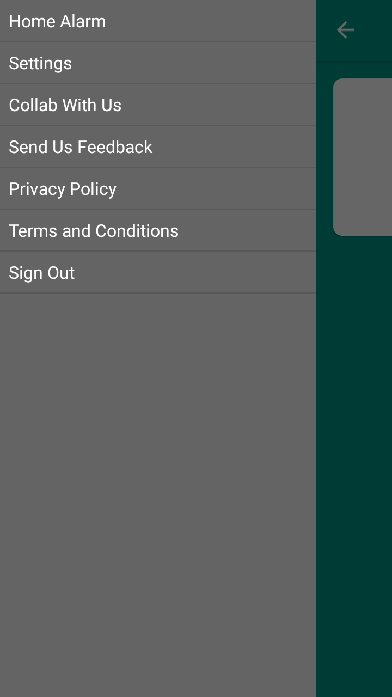
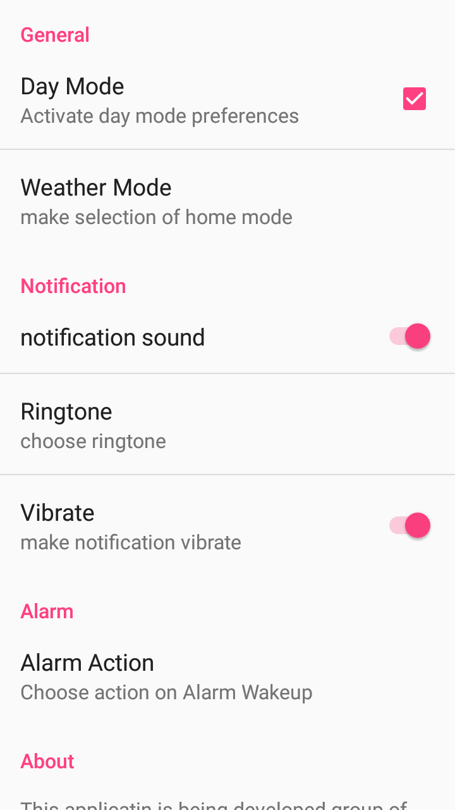

# Home Automation System (Android App)
This is a small experimental project which uses firebase and can control devices set up on a Raspberry Pi using a Relay Board. 
Presently, it is barely functional and is under-development.

## Screenshots
<table>
  <tr>
    <td></td>
    <td></td>
    <td></td>
  </tr>
  <tr>
    <td></td>
    <td></td>
  </tr>
</table>
